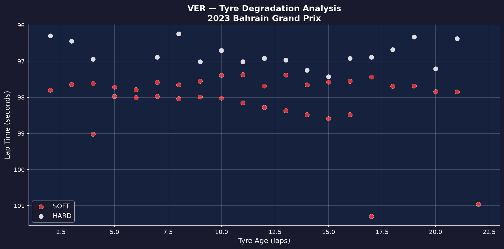
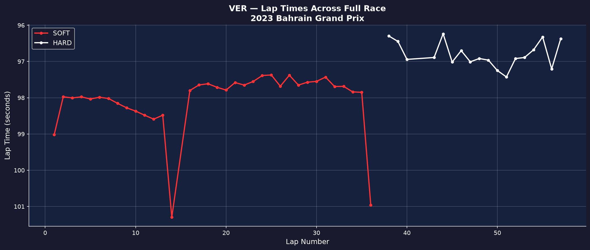
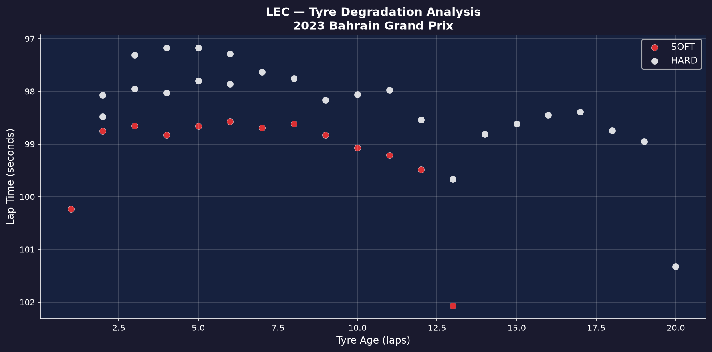
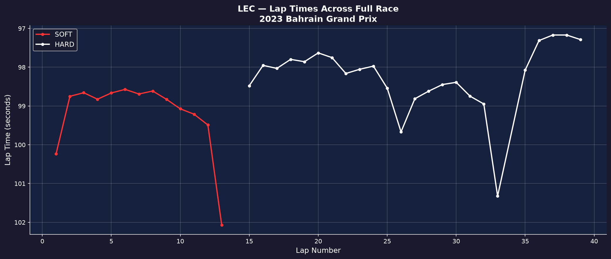
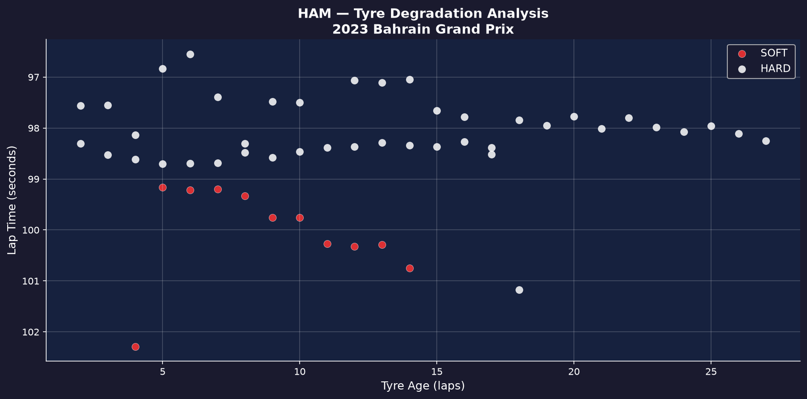
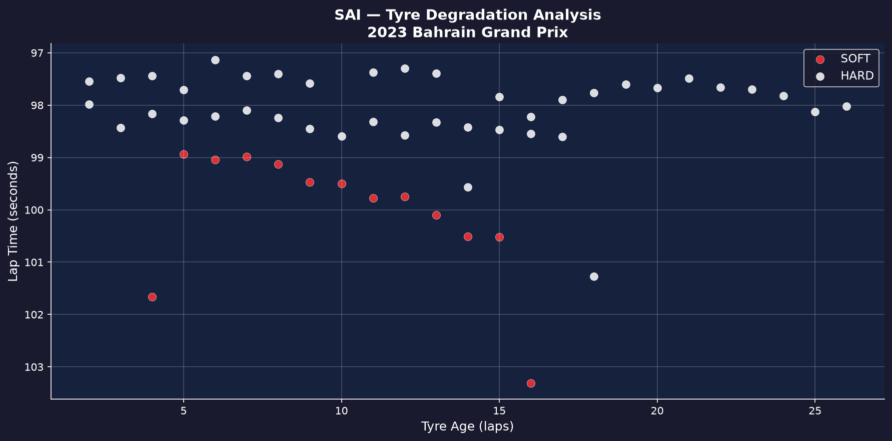
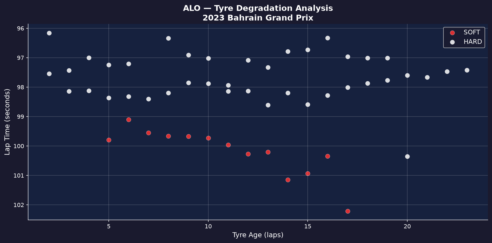
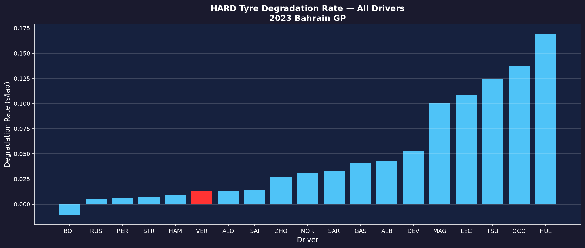
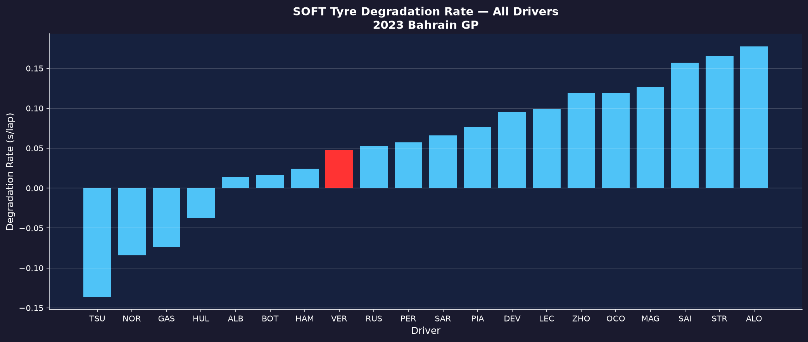
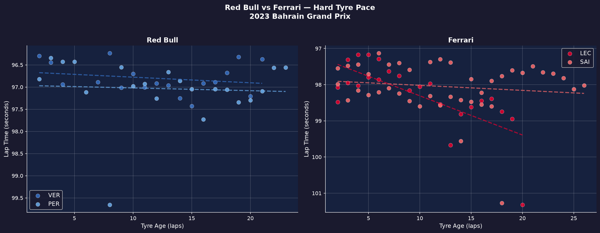

# F1 Tyre Degradation Analyser
Analyses real Formula 1 timing data to study how tyre performance degrades across race laps and compares driver strategies.

## Race Analysed
2023 Bahrain Grand Prix

## What the project does
- Downloads official F1 lap timing data using the FastF1 Python library
- Filters clean laps and removes safety car and pit stop in-laps
- Visualises lap time vs tyre age per compound (scatter plot)
- Plots lap times across the full race to reveal pit stop strategy
- Calculates degradation rate (seconds lost per lap) per compound
- Compares degradation rates across 5 drivers in the same race
- Analyses full field pit stop strategies across 19 drivers
- Compares Red Bull vs Ferrari hard tyre pace with trend lines
- Generates Hard and Soft tyre degradation charts for all drivers

# Platform used
- Pycharm

## Tools used
Python, FastF1, pandas, matplotlib, numpy

## Key Results

### Tyre Degradation Rate — VER vs LEC
| Compound | VER | LEC | Difference |
|----------|-----|-----|------------|
| Soft | +0.048 s/lap | +0.099 s/lap | LEC 2x faster degradation |
| Hard | +0.013 s/lap | +0.108 s/lap | LEC 8x faster degradation |

### Race Strategy
| Driver | Stint 1 | Stint 2 | Stint 3 | Stops |
|--------|---------|---------|---------|-------|
| VER | Soft L1–13 | Soft L15–35 | Hard L37–57 | 2 |
| LEC | Soft L1–13 | Hard L14–39 | — | 1 (retired) |
| HAM | Soft L1–12 | Hard L13–57 | — | 1 |
| SAI | Soft L1–13 | Hard L14–57 | — | 1 |
| ALO | Soft L1–14 | Hard L15–57 | — | 1 |

### Key Finding
Verstappen degraded his Hard tyres 8x slower than Leclerc in the
same race under identical conditions, while also lapping faster overall.
This demonstrates elite tyre management visible directly in timing data which can also explains how he must've won the race.

### Pit Stop Strategy Insight
Norris  ran 5 pit stops — the most aggressive strategy in the race, cycling through all compounds. Multiple drivers pitted on lap 41 simultaneously, suggesting a Virtual Safety Car period made stops free.

## Race Result — Top 3
| Position | Driver | Team |
|----------|--------|------|
| 1st | Max Verstappen | Red Bull Racing |
| 2nd | Sergio Perez | Red Bull Racing |
| 3rd | Fernando Alonso | Aston Martin |

## Graphs

### VER Tyre Degradation

### VER Full Race

### LEC Tyre Degradation

### LEC Full Race

### HAM Tyre Degradation

### SAI Tyre Degradation

### ALO Tyre Degradation

### Hard Tyre Degradation — All Drivers

### Soft Tyre Degradation — All Drivers

### Red Bull vs Ferrari

## Why this matters for F1
Tyre degradation rate is a core input into race strategy decisions —determining pit stop windows, stint lengths, and compound selection.
This project replicates the post-race tyre performance analysis conducted by F1 strategy engineers after every grand prix.

## About
Built as part of my pathway towards becoming a  F1 engineering.
